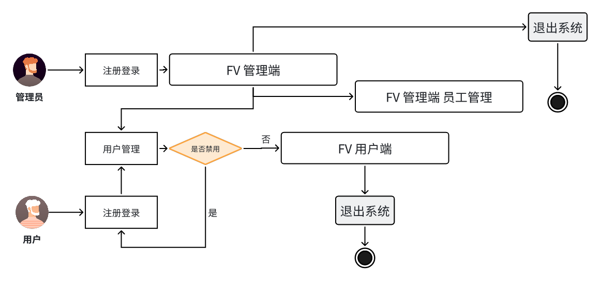
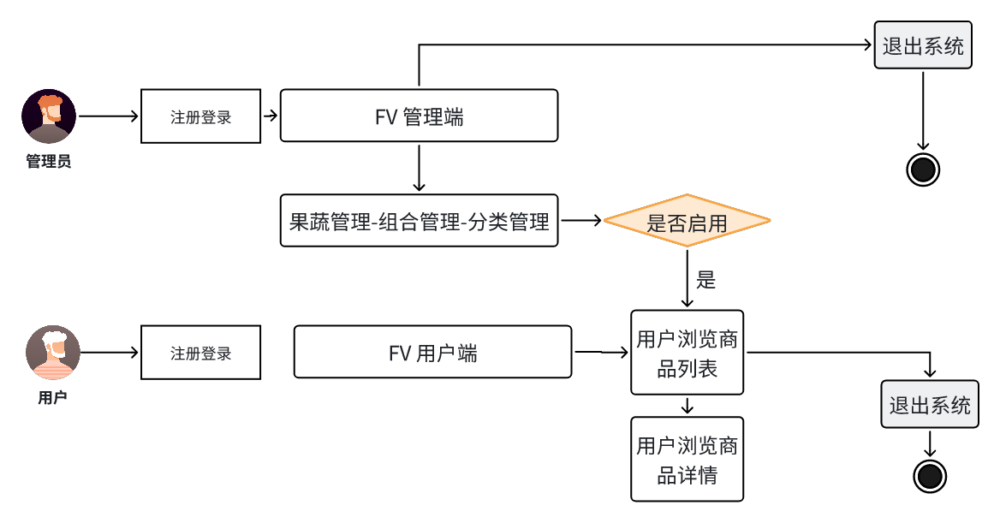
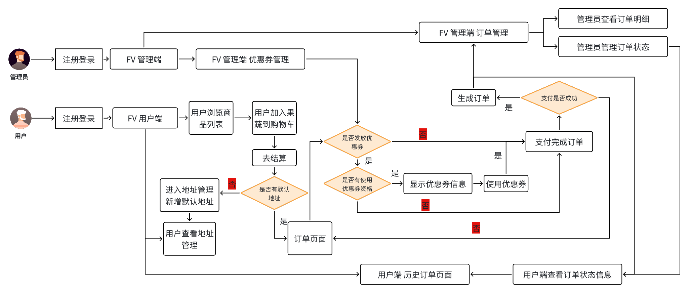
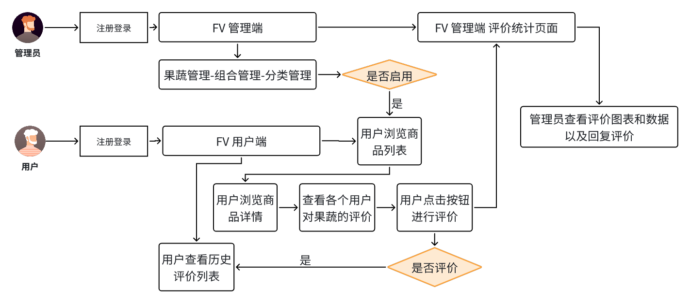
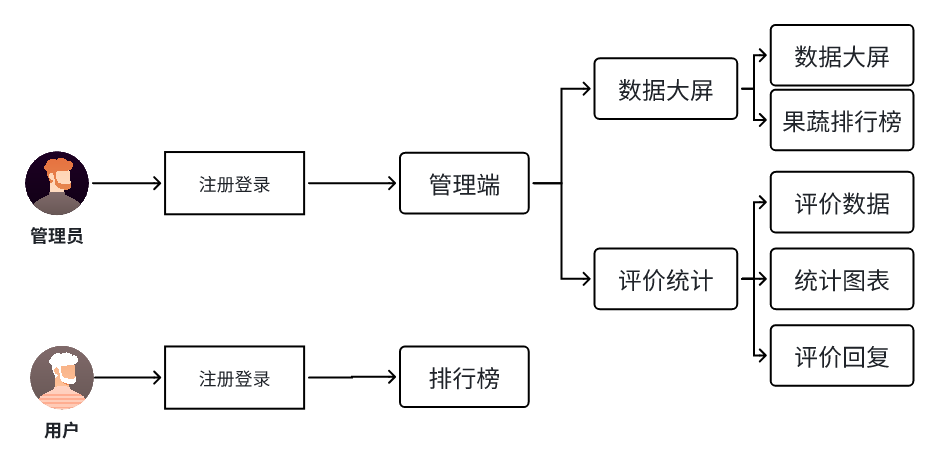
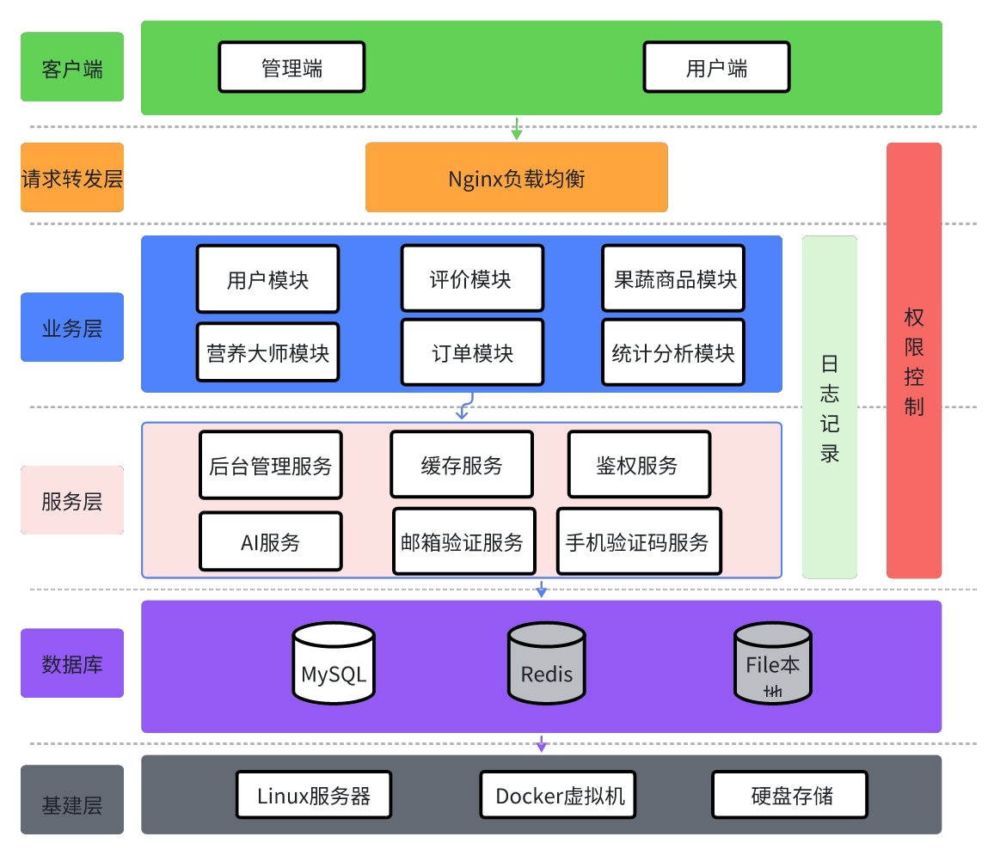
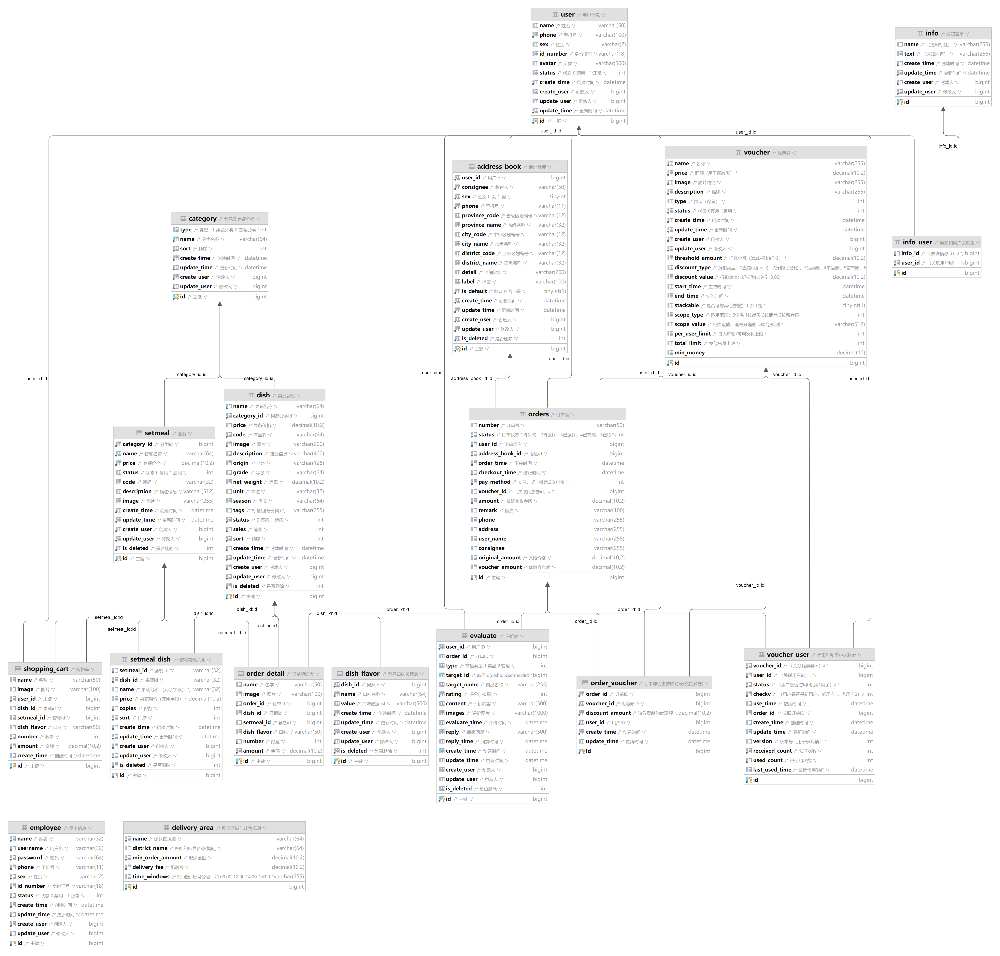

  <h1>AI赋能 福禄蔬菜（果蔬）店</h1>
  
面向餐饮企业与社区居民的一体化果蔬电商与运营管理系统

  

    
    
    
    
    
    
  

## ◈ 项目介绍
FV 福禄蔬菜店是一个偏生产实战的毕业设计级项目，聚焦“果蔬商品交易 + 门店运营管理 + 数据分析 + 智能助手”四位一体场景。  
项目包含管理后台与用户端双端能力，覆盖从商品维护、营销发券、订单履约到评价运营、销售分析的完整业务闭环。

## 缺陷
有些代码没有上传成功，获取完整代码可交流联系后获取🌹🌹🌹🌹🌹，别忘记Star！⭐

## ◈ 能力全景
| 能力域 | 能力说明 |
| --- | --- |
| 平台管理 | 员工管理、用户管理、权限拦截、登录校验、异常统一处理。 |
| 商品管理 | 分类管理、果蔬管理、组合套餐管理、上下架与列表检索。 |
| 交易链路 | 购物车、下单、地址簿、优惠券抵扣、订单状态流转。 |
| 运营工具 | 通知公告发布、优惠券投放与停用、新用户营销策略支持。 |
| 评价运营 | 用户评价、历史评价、管理员回复、评价统计分析。 |
| 数据分析 | 管理端数据大屏、销售排行、订单趋势、用户增长观察。 |
| 移动体验 | 基于 Vant 的移动端交互，覆盖首页、详情、订单、个人中心。 |
| 智能问答 | 集成通义能力，提供果蔬购买建议与上下文连续对话。 |
| 缓存性能 | Redis + Spring Cache 用于高频访问数据缓存，减少数据库压力。 |
| 可扩展性 | 模块化目录结构与分层设计，支持功能平滑扩展和二次开发。 |

## ◈ 详细能力介绍
### 1. 管理后台能力
- 用户与员工管理：支持账号维护、状态启停、信息检索与运营分层管理。
- 商品与分类管理：支持果蔬分类、商品信息、套餐组合、批量操作与业务配置。
- 订单运营能力：支持订单明细查看、状态流转（待处理/派送中/完成等）与异常处理。
- 营销运营能力：支持优惠券新增、发放、核销与停用，适配新人券等策略。
- 通知触达能力：支持公告维护与发布，增强用户端消息触达效率。
- 评价治理能力：支持评价列表、回复机制、评价统计看板。

### 2. 用户端能力
- 首页浏览：展示店铺信息、热门果蔬、推荐组合及快捷入口。
- 商品消费：支持果蔬详情查看、套餐详情查看、规格组合与加入购物车。
- 交易转化：支持地址管理、优惠券抵扣、订单提交与支付流程承接。
- 订单管理：支持最新订单、历史订单查看、再来一单与状态追踪。
- 用户中心：支持个人资料展示、地址簿、评价记录、订单入口聚合。
- 销量排行：支持日榜、周榜、月榜多维统计浏览，提升选购效率。

### 3. 数据分析能力
- 管理端数据大屏：展示用户数、订单数、营业额、排行等核心经营指标。
- 评价统计：支持评价数量、评分分布、回复状态等可视化分析。
- 销量榜单：前台可按时间维度查看高销量果蔬与组合，辅助运营决策。

### 4. 智能助手能力
- 果蔬营养大师：用户可输入“采购建议、营养搭配、食材选择”等咨询问题。
- 上下文会话：支持连续对话并保留上下文（含自动保留/清理策略）。
- 业务融合：可作为前台浮窗助手，辅助用户提高下单决策效率。

### 5. 工程与技术能力
- 前后端分离架构：后端提供 RESTful API，前端按业务模块调用。
- 统一响应与异常治理：提升接口一致性与排障效率。
- 缓存与数据库协同：兼顾读性能与数据一致性管理。
- 模块化代码组织：便于新增功能、替换组件和持续迭代。

## ◈ 快速体验
默认启动后访问：

| 平台 | 地址 | 说明 |
| --- | --- | --- |
| 管理后台 | [http://localhost:8081/backend/index.html](http://localhost:8081/backend/index.html) | 运营、员工、管理员使用 |
| 用户前端 | [http://localhost:8081/front/index.html](http://localhost:8081/front/index.html) | 餐饮客户与社区居民使用 |

## ◈ 业务模块流程图
| 模块 | 流程图 |
| --- | --- |
| 用户模块 |  |
| 果蔬商品模块 |  |
| 订单模块 |  |
| 评价模块 |  |
| 统计分析模块 |  |

## ◈ 项目展示图
### 架构与数据库
| 类型 | 图片 |
| --- | --- |
| 系统架构图 |  |
| 数据库设计图 |  |

### 智能模块展示
| 模块 | 图片 |
| --- | --- |
| 果蔬营养大师 |  |

## ◈ 技术架构
### 后端
- Spring Boot + MyBatis-Plus + MySQL + Redis
- Spring Cache 缓存能力
- 过滤器登录校验与统一异常处理
- 业务分层：Controller / Service / Mapper / Entity / DTO

### 前端
- 管理端：Vue + Element UI + ECharts
- 用户端：Vue + Vant
- Axios 请求封装与业务接口解耦

## ◈ 项目结构
| 模块 | 路径 |
| --- | --- |
| 后端代码 | `src/main/java/com/yzh/fv/` |
| 管理端资源 | `src/main/resources/backend/` |
| 用户端资源 | `src/main/resources/front/` |
| SQL 脚本 | `sql/` |

## ◈ 部署指南
### 环境要求
- JDK 1.8+
- Maven 3.6+
- MySQL 5.7+/8.0+
- Redis 5.0+

### 启动步骤
1. 创建数据库并导入 `sql/` 目录脚本。
2. 修改 `src/main/resources/application.yml` 中数据库与 Redis 配置。
3. 运行 `FVApplication` 启动服务。
4. 使用上方链接访问管理端和用户端页面。

## ◈ 二次开发方向
- 接入真实支付通道（如支付宝沙箱、微信支付）。
- 引入地图与配送范围能力，增强同城履约场景。
- 评价数据智能分析，提供自动化运营建议。
- 扩展多门店模式，支持门店级库存与订单分配。

## ◈ 参与贡献
1. 提交 Issue 说明问题或需求。
2. Fork 仓库并创建功能分支。
3. 提交代码并发起 Pull Request。
4. 等待评审并根据建议迭代。

---

  
Copyright © 福禄蔬菜（果蔬）店 开发团队

